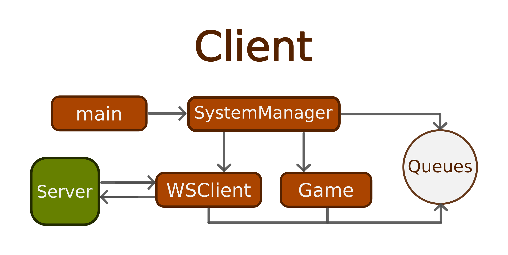

# Online 2 Player Snake
## Client
### Authors: Tyler Black, Blaine Morton

The client application for the 2 player snake game ([server repo found here](https://github.com/khakis23/SnakeGameServer))
TODO

## General Architecture
TODO

## Game Architecture
TODO BLAINE

## Message Protocol

Messages are sent as JSON `code` and `payload` pairs. All server-client
communication is handled by one of these messages.

NOTES:
- Payloads are sent as strings, and coordinates are sent as `x,y` pairs,
  with no spaces.
- NULL payloads do not matter—usually sent as 0.

### **To Client**

| Code          | Payload   | Description                                                 |
|---------------|-----------|-------------------------------------------------------------|
| **SEAT**         | —         | —                                                           |
| **START**        | `player`  | Both users connected, start app (before set, first message) |
| **COLLISION**    | `player`  | Snake collided                                              |
| **APPLE**        | `x,y`     | Sends new apple coordinates                                 |
| **GROW**         | `player`  | Tells client that a `player` should grow                    |
| **SCORE**        | `s1,s2`   | Sends updated scores for both players                       |
| **SET**          | —         | Both players ready, start game                              |
| **DISCONNECT**   | `player`  | Notifies that a `player` disconnected                       |

### **Both Directions**

| Code        | Payload | Description                                   |
|-------------|----------|-----------------------------------------------|
| **MOVE**       | `x,y`    | Movement update (player → server, server → client) |

### **To Server**

| Code        | Payload | Description                         |
|-------------|----------|-------------------------------------|
| **READY**      | —        | Client indicates it is ready to start game |
| **RESET**      | —        | Client requests a full game reset |   |

## Build
TODO